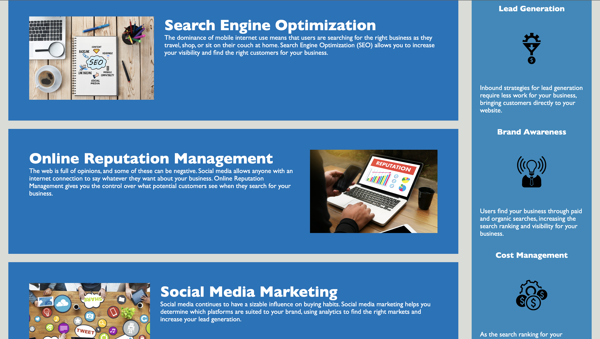

# challenge01
Horiseon website for challenge 01
# Horiseon - Accessibility code fixes
## Description 

Horiseon's website needed to be made more accessible, so I was tasked to go through the code and make changes.
This included: Changing semantic tags within the HTML, linking the CSS, changing the structure to make it more logical, and completing fixes such as broken links.

I learned how to ensure the changes you make to an HTML are transferred to CSS, as well as how to make notes in code!

## Table of Contents (Optional)

* [Technologies](#technologies)
* [Installation](#installation)
* [Usage](#usage)
* [Credits](#credits)
* [License](#license)

## Technologies

* Visual studio code
* Google chrome

## Installation

git clone git@github.com:kshaikh24/horiseon.git
cd ../path/to/the/file
npm install
npm start

## Usage 

Website should look as the following screenshots show.

Scroll up and down the page and click internal links in the nav bar.

## Credits

Original source code: EDX Front end Bootcamp

Tutorials followed: 

Semantic tags: https://www.w3schools.com/html/html5_semantic_elements.asp
Readme: https://www.freecodecamp.org/news/how-to-write-a-good-readme-file/

## License

See repository (MIT)

---

© 2023 edX Boot Camps LLC. Confidential and Proprietary. All Rights Reserved.
